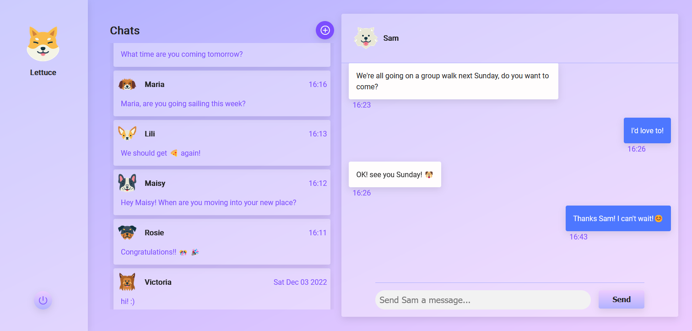

# simplechat

This project is simple chat application.

After a user has logged in, Simple Chat displays a list of the user's active conversations alongside an active chat:



The user chat click the "Add Chat" button and select a new user to chat with:


## Technologies

Project is created with:

- Lorem version: 12.3
- Ipsum version: 2.33
- Ament library version: 999

## Features

-

## Setup

To run this project, install it locally using npm:

```
$ cd ../lorem
$ npm install
$ npm start
```
