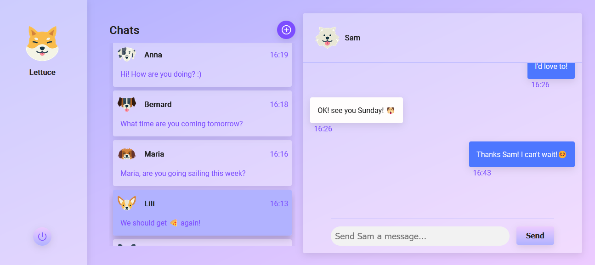
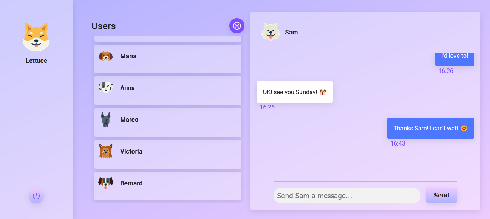

# Simple Chat

This project is realtime chat application using React, Node.js, Socket.io and MongoDB.

## Features

Simple Chat's users log into an account and exchange messages with other users.

After a user has logged in, Simple Chat displays a list of the user's active conversations alongside an active chat:

The user can click the "Add Chat" button and select a new user to chat with:

### To Do

- Register and select an avatar.
- Group chats.

## Setup

After you clone this repo to your desktop, install all the dependencies by navigating to both the "react-client" and the "server" directories, and running `npm install` in each.

To run, use `npm start` for both directories. The server directory should have a `.env` containing your MongoDB connection URL.
